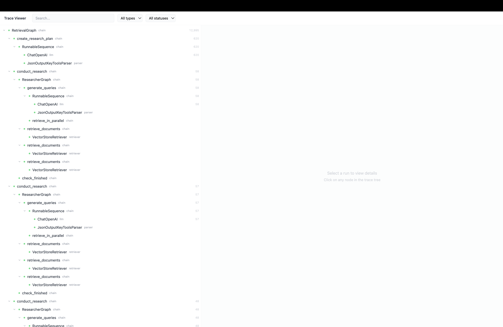
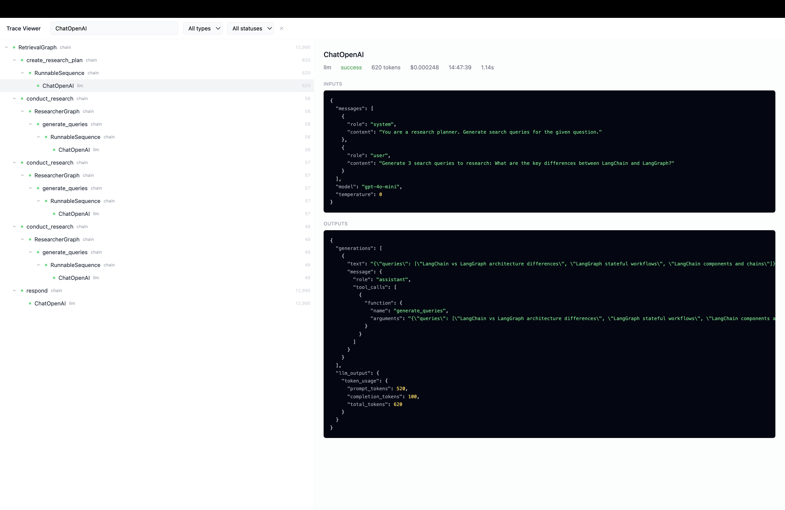
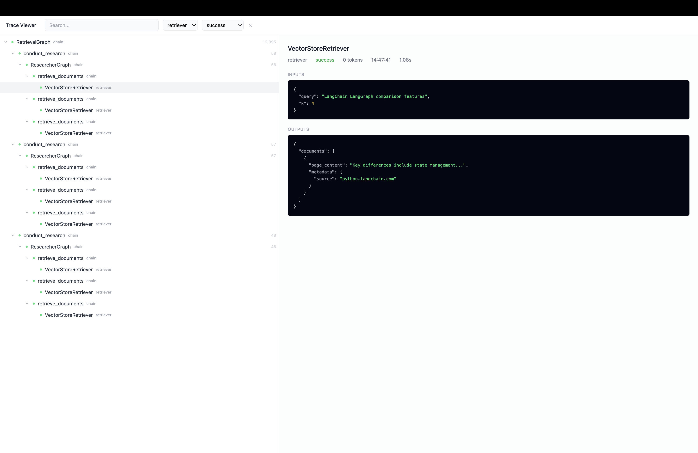
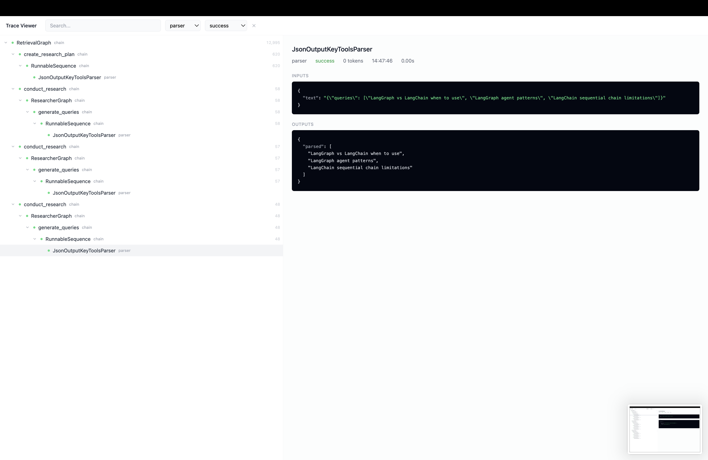

# LangSmith Trace Viewer

A hierarchical trace viewer for LangSmith execution traces. Navigate through LLM application execution trees, inspect individual run inputs/outputs, and filter by name, type, or status.

  

## Screenshots

### Full trace tree with all nodes expanded


### LLM run detail — ChatOpenAI with messages, model config, and token usage


### Filtered by type: retriever — showing only retriever nodes with ancestor context


### Filtered by type: parser — JsonOutputKeyToolsParser with parsed query output


## Quick Start

```bash
# Install dependencies
cd server && npm install && cd ..
cd client && npm install && cd ..

# Start backend (port 3001)
cd server && npm run dev

# In a new terminal — start frontend (port 3000)
cd client && npm run dev
```

Open [http://localhost:3000](http://localhost:3000)

## Features

### Tree Visualization
- Converts a flat, unordered array of `RunNode` objects into a hierarchical tree using `parent_run_id` relationships
- Children are sorted by `start_time` at every level
- Each node displays its name, run type, status indicator, and token count

### Interactive Navigation
- Expand/collapse any node with children via chevron toggle
- Click any node to select it and load its details in the right panel
- All nodes start expanded on initial load

### Run Details Panel
- Displays metadata: run type, status, token count, cost, start time, and computed duration
- Fetches and renders formatted inputs/outputs as syntax-highlighted JSON
- Shows error details in a dedicated section when a run has errors
- Loading state while fetching, empty state when nothing is selected

### Search and Filter
- Text search filters nodes by name (case-insensitive)
- Dropdown filters for run type and status
- Filtered results preserve ancestor nodes to maintain tree context
- Clear button resets all filters at once

## Architecture

```
client/src/
├── App.tsx                          # Root component
├── components/
│   ├── TraceViewer.tsx              # Main container — data fetching, state, layout
│   ├── TraceTree.tsx                # Tree wrapper for root nodes
│   ├── TreeNodeComponent.tsx        # Recursive tree node (expand/collapse, selection)
│   ├── RunDetailsPanel.tsx          # Detail view (metadata, JSON, errors)
│   └── SearchFilterBar.tsx          # Search input + filter dropdowns
├── utils/
│   └── tree.ts                      # buildTree() and filterTree() pure functions
└── types/
    └── index.ts                     # RunNode, RunContent, TreeNode types

server/src/
├── index.ts                         # Express app setup
├── routes/
│   └── traces.ts                    # GET /api/traces, GET /api/traces/:runId
├── data/
│   ├── traceTree.ts                 # Mock trace data (49 nodes, flat array)
│   └── singleRuns.ts               # Mock run detail data (inputs/outputs)
└── models/
    └── types.ts                     # Server-side type definitions
```

## API Endpoints

| Method | Endpoint | Description | Response |
|--------|----------|-------------|----------|
| GET | `/api/traces` | Get all trace nodes | `RunNode[]` (flat array, 1s delay) |
| GET | `/api/traces/:runId` | Get run inputs/outputs | `RunContent` (300ms delay) |

## Key Design Decisions

**Tree building from flat array** — The API returns an unordered flat array. `buildTree()` creates a `Map<id, TreeNode>`, links children to parents via `parent_run_id`, and sorts recursively by `start_time`. This runs once via `useMemo` when data loads.

**Filter with ancestor preservation** — `filterTree()` walks the tree bottom-up. A node is kept if it matches the predicate OR any descendant matches. This ensures filtered results always show the full path from root, maintaining navigable tree structure.

**Minimal state management** — All state lives in `TraceViewer` via `useState` + `useMemo`. No external state libraries. Derived values (tree, filtered tree, unique types/statuses) are computed with `useMemo` to avoid unnecessary recalculation.

**Minimal UI** — Monochrome palette with small colored status dots as the only accent. Run type shown as subtle text rather than colored badges. Dark JSON blocks with muted syntax highlighting.

## Tech Stack

- **Frontend:** React 18, TypeScript, Tailwind CSS, Vite, Lucide React (icons)
- **Backend:** Express, TypeScript, tsx (dev runner)
- **Dev:** Vite proxy forwards `/api` requests to the Express server

## Data Shape

```typescript
interface RunNode {
  id: string;
  name: string;
  run_type: string;        // "chain" | "llm" | "retriever" | "parser"
  status: string;          // "success" | "error"
  start_time: string;
  end_time: string | null;
  error: string | null;
  parent_run_id: string | null;
  trace_id: string;
  total_tokens?: number | null;
  total_cost?: number | null;
}

interface RunContent {
  id: string;
  inputs: Record<string, any>;
  outputs: Record<string, any>;
}
```

The trace data represents a `RetrievalGraph` execution with 49 nodes across 5 run types: chain (26), retriever (9), llm (4), parser (3), and their nested children across 3 research iterations followed by a final response generation.
